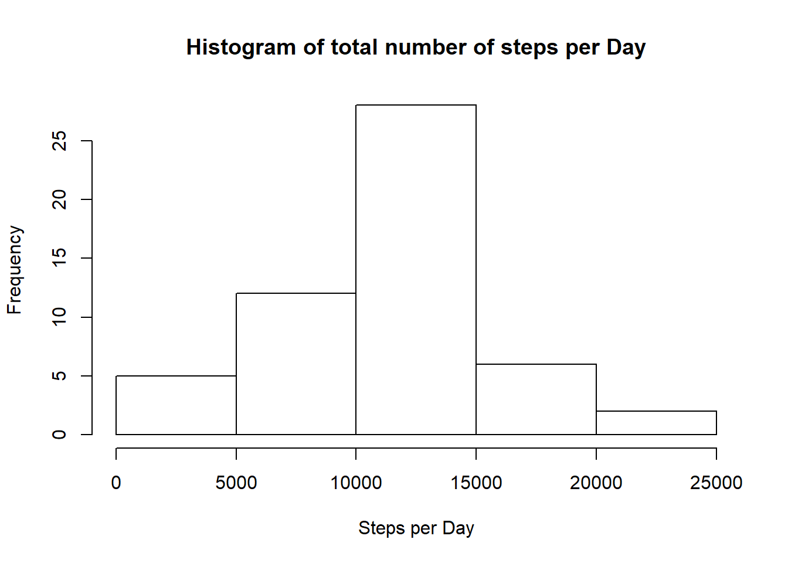
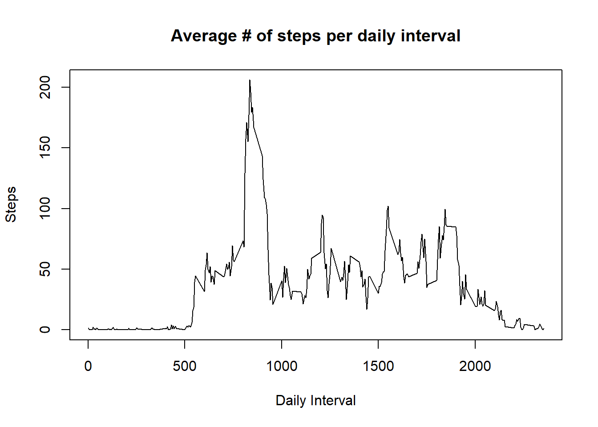
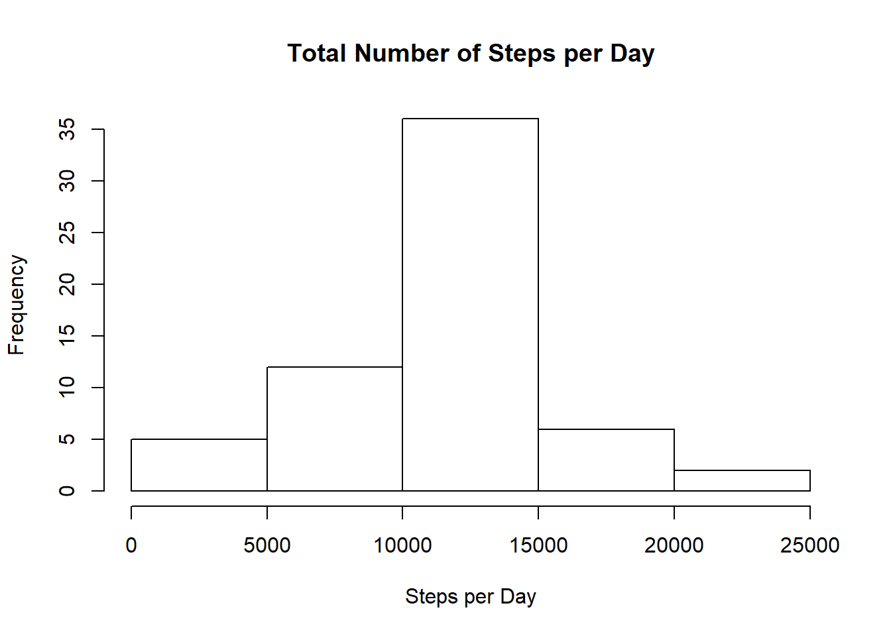
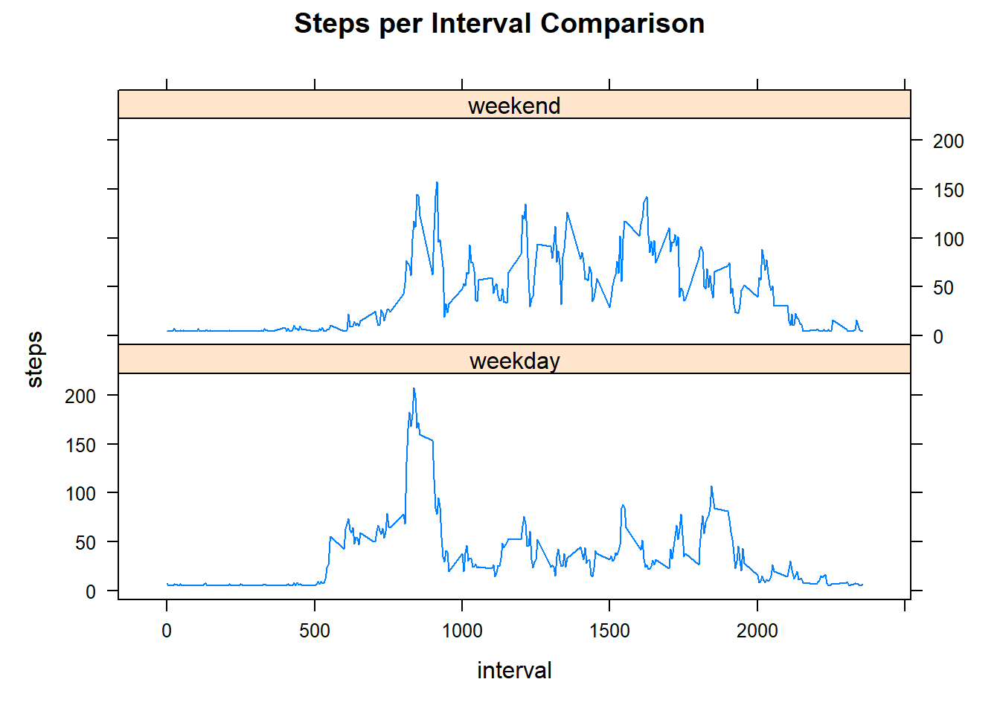

Course Project 1
================
Megan Ruda
4/28/2022

``` r
knitr::opts_chunk$set(fig.path='instructions_fig/')
```

## Loading and preprocessing the data

### *Installing packages*

``` r
library(ggplot2)
library(dplyr)
```

    ## 
    ## Attaching package: 'dplyr'

    ## The following objects are masked from 'package:stats':
    ## 
    ##     filter, lag

    ## The following objects are masked from 'package:base':
    ## 
    ##     intersect, setdiff, setequal, union

### *Loading Activity Data*

``` r
activity = read.csv("./activity.csv",header=TRUE, colClasses = c("integer", "Date", "integer"))
```

## What is the mean total number of steps taken per day?

### *Calculate the total number of steps taken per day*

``` r
sumsteps <- aggregate(steps ~ date, activity, sum, na.rm = TRUE)
```

### *Show histogram of total number of steps taken per day*

``` r
hist(sumsteps$steps, xlab = "Steps per Day", main = "Histogram of total number of steps per Day")
```

<!-- -->

``` r
result.meansteps <- round(mean(sumsteps$steps, na.rm = TRUE), 0)
result.mediansteps <- round(median(sumsteps$steps, na.rm = TRUE), 0)
print(paste("Mean steps per day",result.meansteps))
```

    ## [1] "Mean steps per day 10766"

``` r
print(paste("Median steps per day",result.mediansteps))
```

    ## [1] "Median steps per day 10765"

## What is the average daily activity pattern?

``` r
intervalsteps <- aggregate(steps ~ interval, activity, mean)
plot(intervalsteps$interval, intervalsteps$steps, xlab="Daily Interval", ylab="Steps", type = "l", main = "Average # of steps per daily interval")
```

<!-- -->

``` r
intervalmax <- intervalsteps[which.max(intervalsteps$steps),1]
print(paste("The 5 minute interval that contains the maximum number of steps is",intervalmax))
```

    ## [1] "The 5 minute interval that contains the maximum number of steps is 835"

## Imputing missing values

``` r
nacount <- sum(is.na(activity$steps))
print(paste("There are", nacount, " NA values in the data set."))
```

    ## [1] "There are 2304  NA values in the data set."

``` r
newactivity <- activity
newactivity$steps[is.na(newactivity$steps)] <- mean(newactivity$steps, na.rm = TRUE)

sumnewsteps <- aggregate(steps ~ date, newactivity, sum, na.rm = TRUE)
hist(sumnewsteps$steps, xlab = "Steps per Day", main = "Total Number of Steps per Day")
```

<!-- -->

``` r
results.meansteps <- round(mean(sumnewsteps$steps, na.rm = TRUE), 0)
results.mediansteps <- round(median(sumnewsteps$steps, na.rm = TRUE), 0)
print(paste("Mean steps per day",results.meansteps))
```

    ## [1] "Mean steps per day 10766"

``` r
print(paste("Median steps per day",results.mediansteps))
```

    ## [1] "Median steps per day 10766"

When removing the NA values and replacing them with 0, there is no
difference in the mean number of steps per day and only a slight
difference (one step) in the median number of steps per day.There does
not appear to be a significant impact on imputing missing data on the
estimates of the total daily number of steps.

## Are there differences in activity patterns between weekdays and weekends?

``` r
library(lattice)
activity1 <- newactivity
activity1$weekday <- weekdays(activity1$date)
activity1$day <- ifelse(activity1$weekday == "Saturday" | activity1$weekday == "Sunday", "weekend", "weekday")
result.meanstep1 <- aggregate(steps ~ interval + day, FUN = mean, data = activity1)
xyplot(steps~interval | day, 
       data = result.meanstep1, type = "l", layout = c(1,2), main = "Steps per Interval Comparison")  
```

<!-- -->

When breaking out the interval patterns between weekdays and weekends,
there is a shift in activity until later in the day on weekends.
Weekends also indicate higher peaks of activity when compared with
weekdays.
